# 饭店系统（客户端，员工端，老板端）

#### 介绍
本系统分为管理端和用户端，以管理端为主体进行数据交互。便于餐馆管理员管理餐馆账目和员工信息，方便顾客点餐和结账，提高餐馆工作效率、管理水平以及顾客的就餐体验。
在制作数据流图和系统结构图时，通过确定管理端和客户端主要实现的几个功能以及一些实体信息间的联系，以及对现实生活中可行性分析（如一开始我们没有考虑到进货的情况，菜品与订单之间的联系以及实际操作中系统管理员操作的繁琐程度），最后完成绘图。

#### interface文件夹为前端系统界面
#### server文件夹为后端服务器

#### 系统展示

- 登录界面
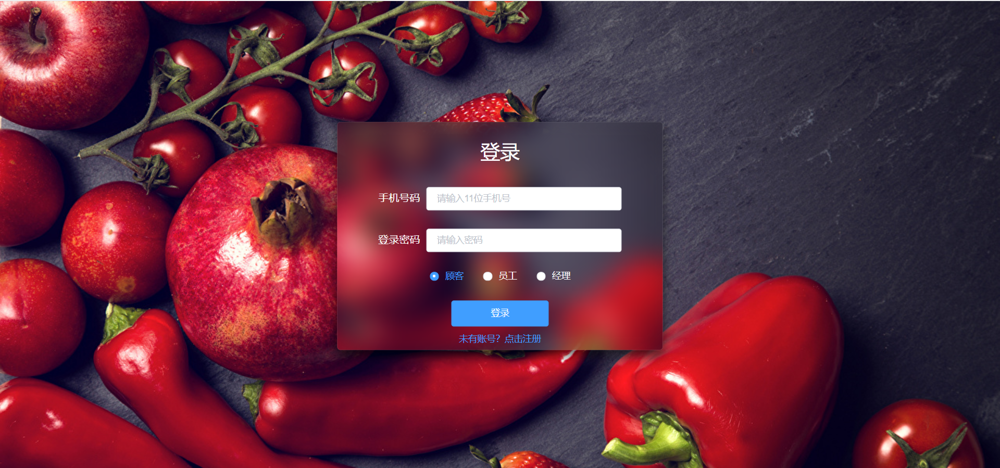
- 客户界面
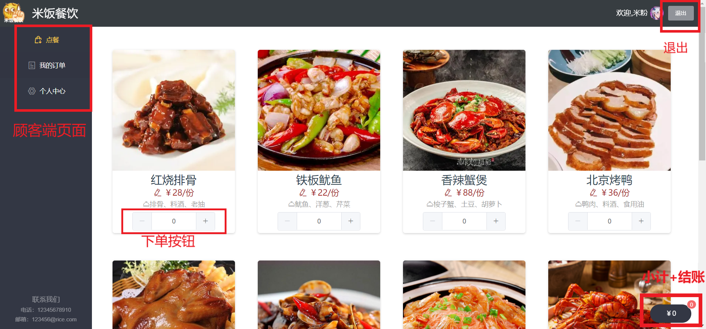
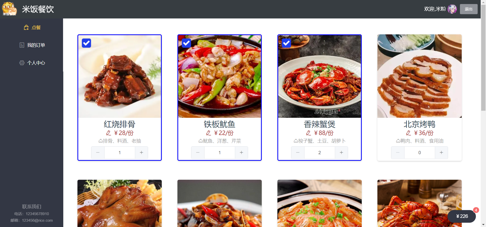
- 客户订单确认界面
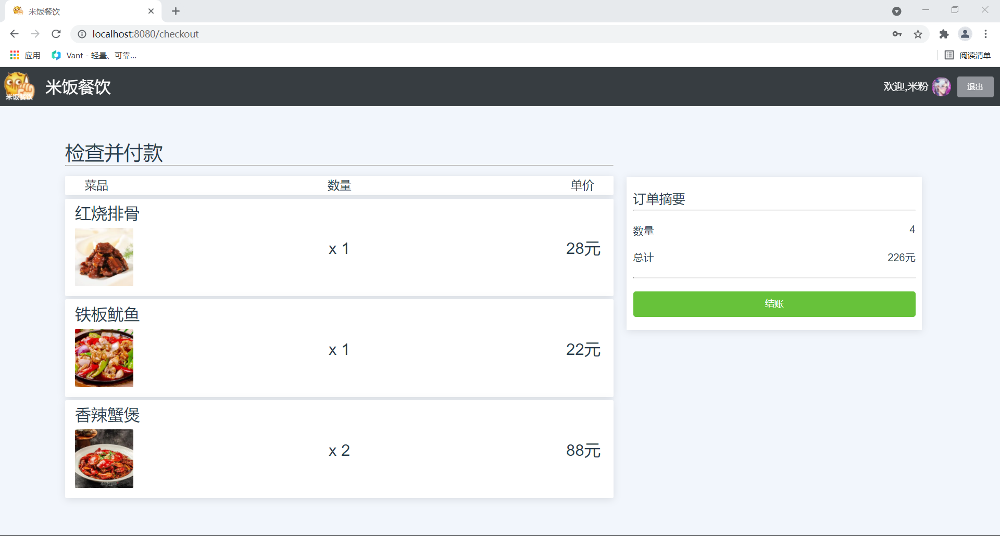
- 客户下单成功页面

- 个人信息修改页面（客户、员工、老板端一致）
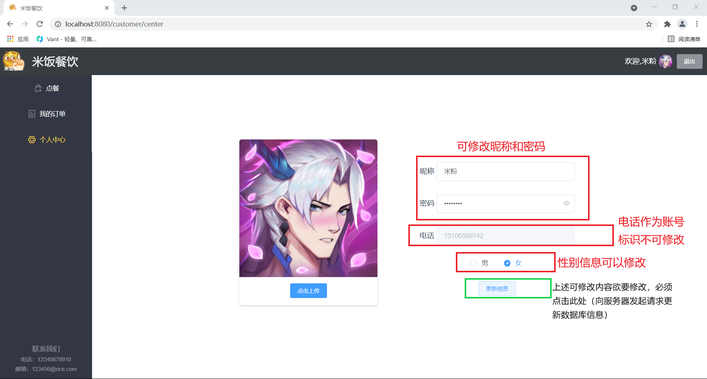
- 客户查看订单页面
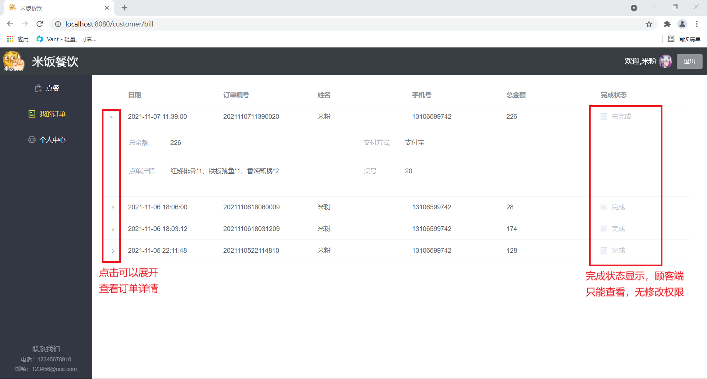
- 老板端界面（可以操作订单状态，管理食材仓库，查看供应商名单，修改老板个人信息，管理员工信息，管理菜单）
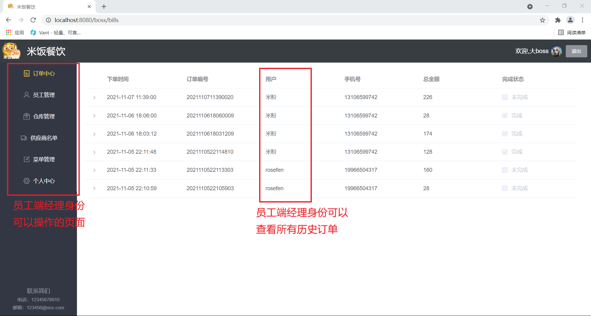
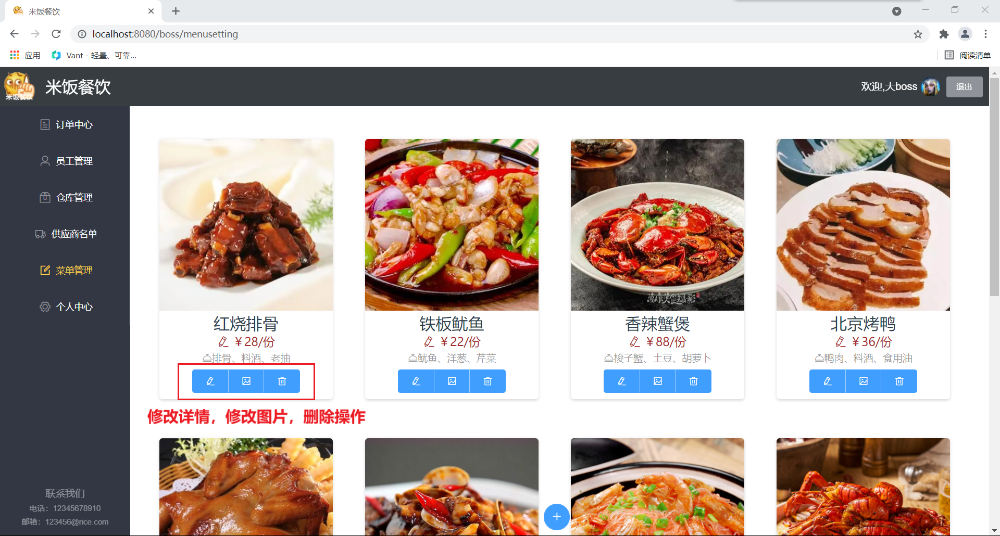
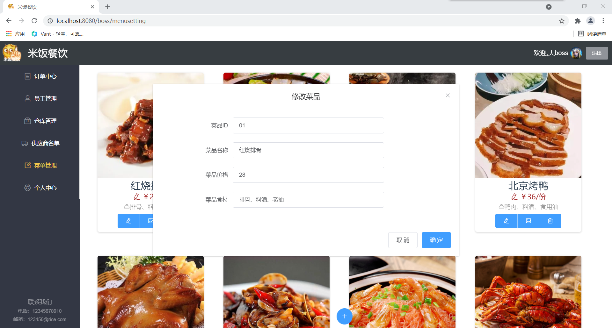
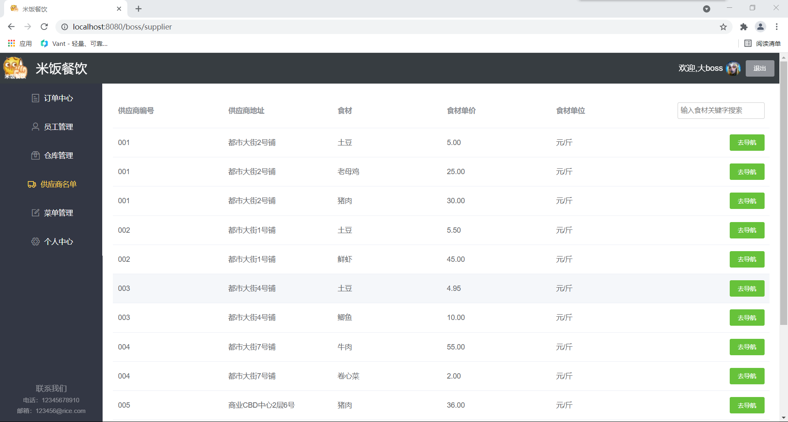
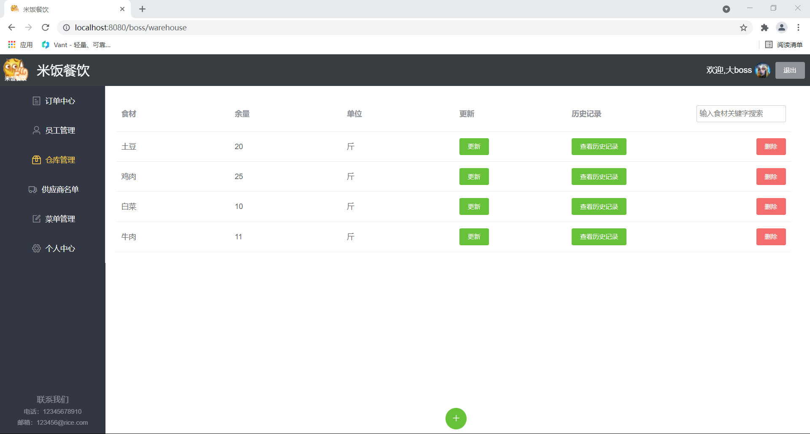
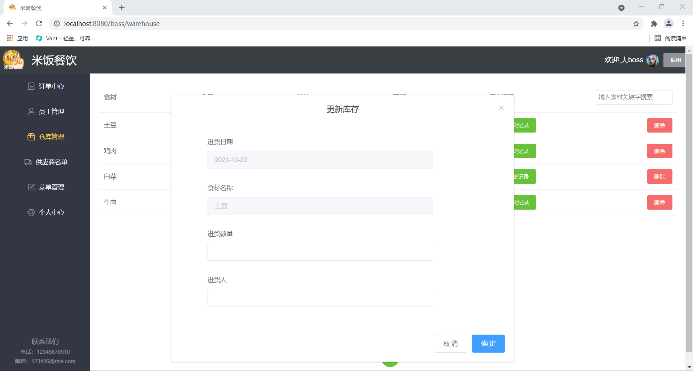
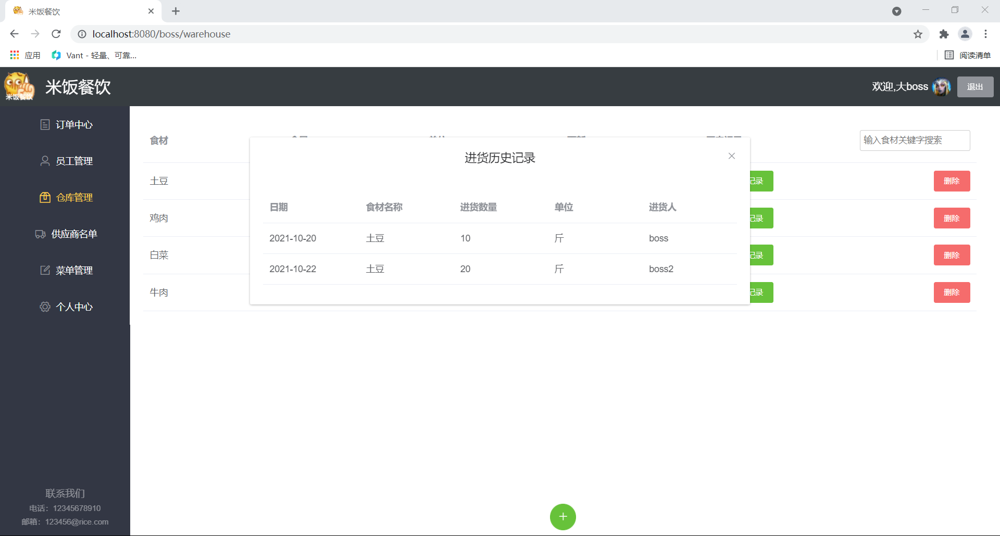

- 员工端管理界面（可以操作订单状态，管理食材仓库，查看供应商名单，修改员工个人信息）
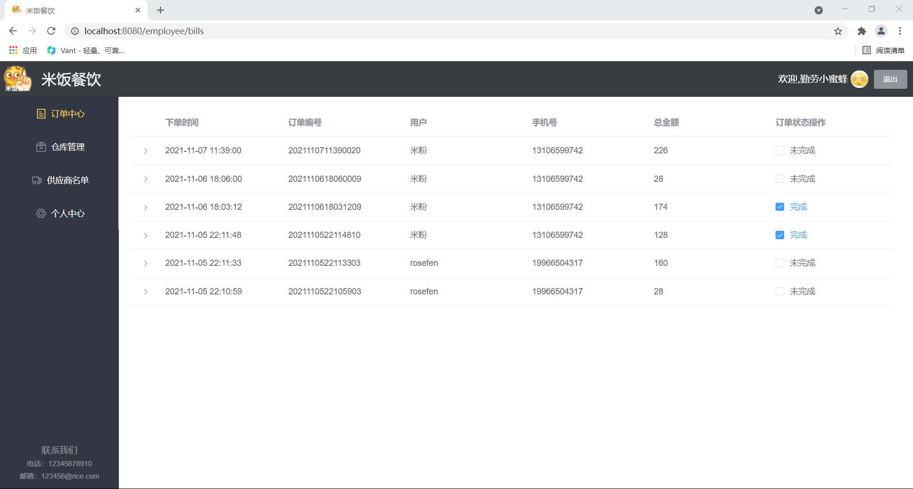
